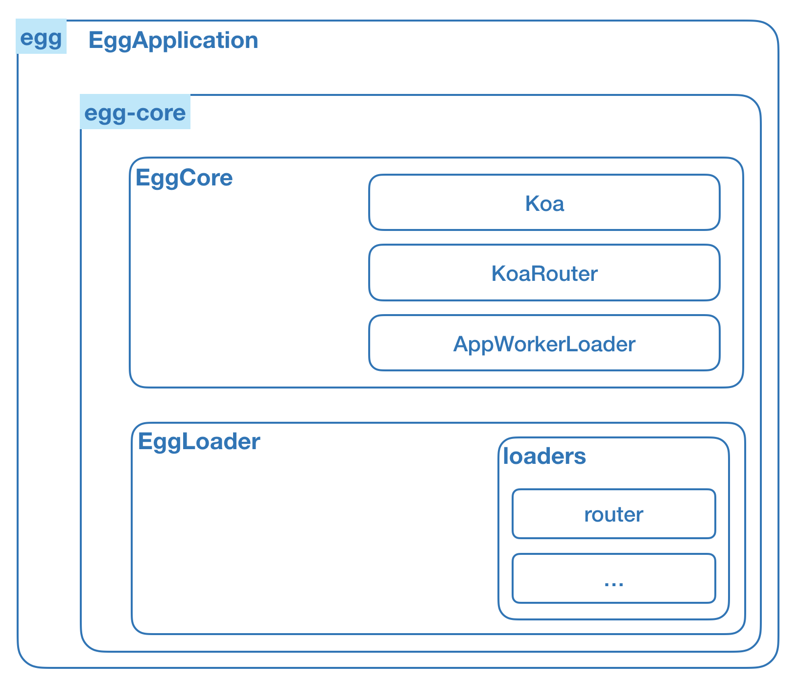

# Egg.js 模块归类


从前面的章《Egg.js最小系统》中，通过demo中的核心文件 [001-mini/lib/egg.js](https://github.com/chenshenhai/eggjs-note/blob/master/demo/001-mini/lib/egg.js)可以看到一百多行代码实现了 Egg.js 的最小系统。看似非常简单，然而实际上Egg.js的实现要复杂很多，也不可能一份js文件就能囊括所有功能，所以这个时候就需要将最小系统进行模块的划分和归类。

## 核心模块归类

根据实际上 Egg.js 的设计理念，我们将[001-mini/lib/egg.js](https://github.com/chenshenhai/eggjs-note/blob/master/demo/001-mini/lib/egg.js)的源码根据模块`egg`和 `egg-core`的划分，一一对应划分成如下的归类。

### 模块划分

- egg `EggApplication`
- egg-core 
  - core `EggCore`
  - loader `EggLoader`
    - mixin 
      - `router`
      - `...` 
  - utils
    - `Router`

### 模块结构图



  

## 模块归类源码实现

 [demo传送门](https://github.com/chenshenhai/eggjs-note/tree/master/demo/001-module)

### 目录讲解

```sh
.
├── app # Egg.js 应用目录
│   └── router.js
├── index.js # Egg.js 应用启动文件
├── lib # Egg.js 相关模块目录
│   ├── egg # 模拟npm模块egg的最小系统 
│   │   └── index.js 
│   └── egg-core # 模拟npm模块egg-core的最小系统
│       ├── index.js
│       └── lib
│           ├── egg.js # egg-core核心类，继承koa
│           ├── loader
│           │   ├── egg_loader.js # egg-core加载器
│           │   └── mixin # egg-core 各加载器内容
│           │       └── router.js
│           └── utils # egg-core工具目录 
│               └── router.js # egg-core内置Router，继承koa-router
└── package.json
```

### 运行demo

```sh
cd eggjs-note/001-module/

npm i

npm start
```
